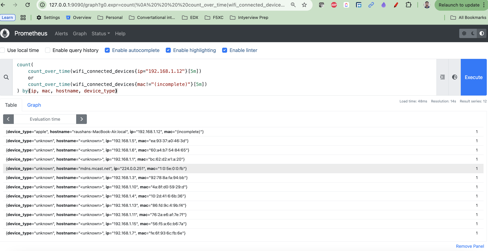
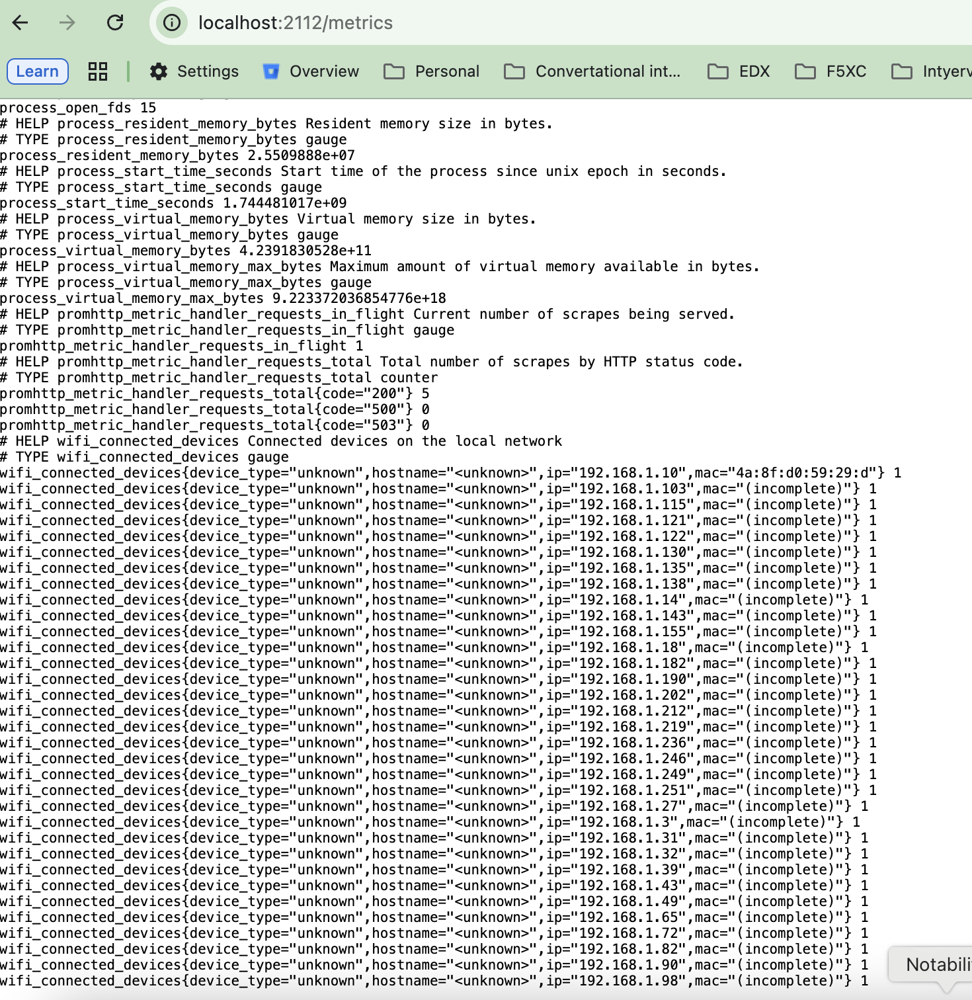
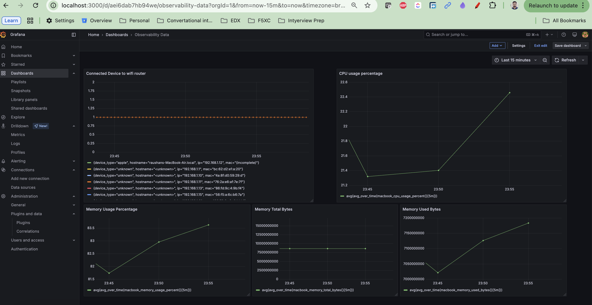
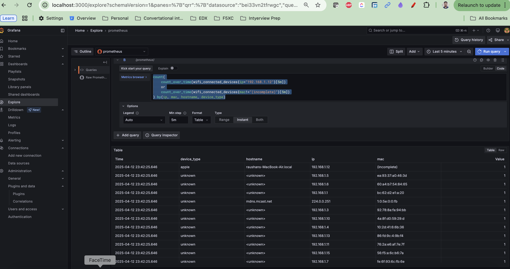
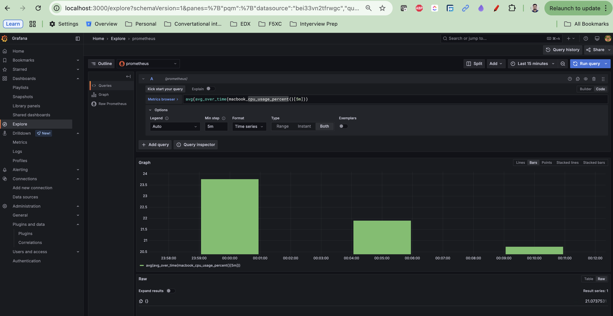
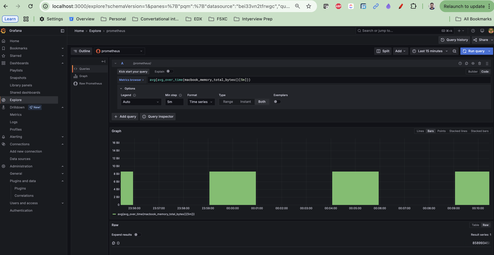
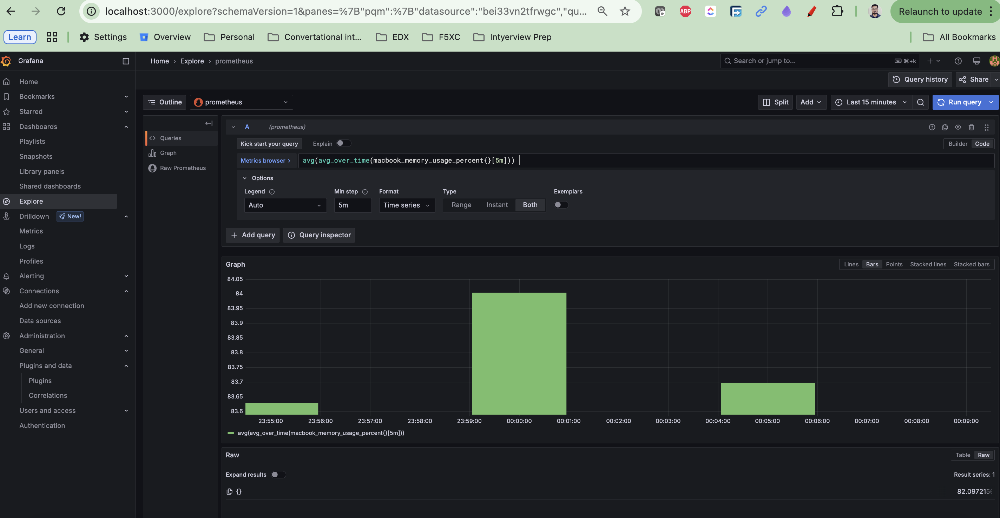
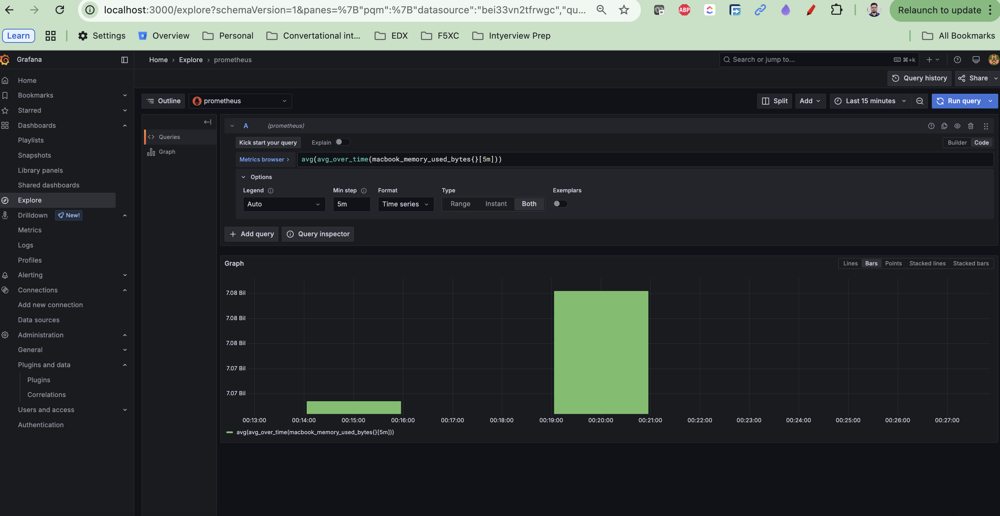

# Prometheus Metrics Exporter (CPU/Memory) in Go

This is a simple Prometheus exporter written in Go that collects **CPU and memory usage metrics** from the local machine (e.g., MacBook) and exposes them via an HTTP endpoint for Prometheus to scrape.

---

## 🚀 Tools to be configured
- Prometheus
- Grafana
- Node-exporter

## 🚀 Docker-compose file (docker-compose.yml)
```bash
version: '3.8'

services:
  prometheus:
    image: prom/prometheus:latest
    container_name: prometheus-local
    volumes:
      - ./prometheus/prometheus.yml:/etc/prometheus/prometheus.yml
    command:
      - '--config.file=/etc/prometheus/prometheus.yml'
    ports:
      - 9090:9090
    networks:
      - monitoring

  node-exporter:
    image: prom/node-exporter:latest
    container_name: node-exporter-local
    ports:
      - 9100:9100
    networks:
      - monitoring

  grafana:
    image: grafana/grafana-oss:latest
    container_name: grafana-local
    ports:
      - 3000:3000
    networks:
      - monitoring
    environment:
      - GF_SECURITY_ADMIN_USER=admin
      - GF_SECURITY_ADMIN_PASSWORD=admin

networks:
  monitoring:
```

## 🚀 Features

- Collects **real system-level metrics** (not just Go runtime stats)
- Tracks:
  - CPU usage percentage
  - Memory usage percentage
  - Total and used memory in bytes
- Exposes metrics at `/metrics` on port `2112`
- Lightweight and suitable for local monitoring setups

---

## 📦 Dependencies

#### Install Go dependencies:

```bash
go mod init telemetry-test
go get github.com/prometheus/client_golang/prometheus
go get github.com/prometheus/client_golang/prometheus/promhttp
go get github.com/shirou/gopsutil/v3/cpu
go get github.com/shirou/gopsutil/v3/mem
```

## 📂 Project Structure
```bash
telemetry-test/
├── config.yaml     # Configuration file
├── main.go         # core logic 
```

## 🔧 How to Run
```bash
cd <go_to_this_directory>
go run main.go

Once running, visit http://localhost:2112/metrics to see metrics in Prometheus format.
```

## 📊 Example Output

#### HELP macbook_cpu_usage_percent CPU usage percentage on MacBook
#### TYPE macbook_cpu_usage_percent gauge
macbook_cpu_usage_percent 17.8

#### HELP macbook_memory_usage_percent Memory usage percentage on MacBook
#### TYPE macbook_memory_usage_percent gauge
macbook_memory_usage_percent 71.3

macbook_memory_total_bytes 17179869184
macbook_memory_used_bytes 12259811328


## ⚙️ Prometheus Scrape Config
```bash
global:
  scrape_interval: 5s  # how often to scrape targets

scrape_configs:
  - job_name: "go_app_metrics"
    static_configs:
      - targets: ["host.docker.internal:2112"]
```

## URLs
```bash
Prometheus url : http://127.0.0.1:9090/
Grafna url : http://localhost:3000/
Node-exporter : http://localhost:2112/metrics
```

## Screenshots

### 

### 

### 

### 

### 

### 

### 

### 

